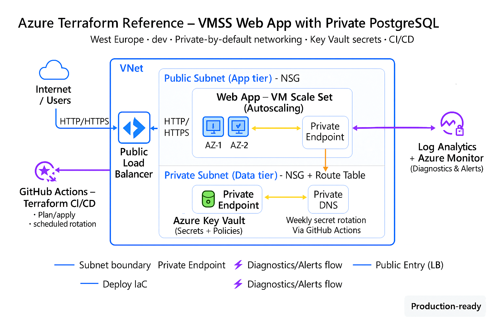

# 🌐 Azure Terraform Infrastructure — Modular, Secure, Scalable

A complete Azure infrastructure built with **Terraform**, designed for a secure, autoscaling web application with PostgreSQL backend, centralized diagnostics, secret rotation, and CI/CD integration.

---

## 🧱 Architecture Overview

> **Environment:** `dev`  
> **Region:** `West Europe`  
> **IaC Tool:** Terraform  
> **Automation:** GitHub Actions

---

## 📦 Modules Breakdown

| Module                | Purpose                                                  |
|-----------------------|----------------------------------------------------------|
| `resource_group`      | Creates the base resource group                          |
| `vnet` + `subnet`     | Sets up virtual network and public/private subnets       |
| `nsg` + `nsg_assoc`   | Configures network security groups and associations      |
| `route_table`         | Adds routing for private subnets                         |
| `private_dns_zone`    | Enables private DNS for PostgreSQL and Web App           |
| `key_vault`           | Manages secrets securely                                 |
| `kv_access_policy`    | Grants access to Key Vault                               |
| `secret_rotation`     | Automates password generation and storage                |
| `postgres`            | Deploys PostgreSQL Flexible Server                       |
| `webapp_vmss`         | Deploys autoscaling VMSS-based web app                   |
| `private_endpoint`    | Connects services privately via Azure backbone           |
| `log_analytics`       | Centralized logging workspace                            |
| `diagnostics`         | Attaches monitoring to Key Vault, PostgreSQL, VMSS       |
| `alerts`              | Adds Azure Monitor alerts for CPU and memory             |
| `autoscale`           | Configures autoscaling rules for VMSS                    |

---

## 🔐 Security Highlights

- 🔑 Secrets stored in **Azure Key Vault**
- 🔒 Access policies scoped to specific identities
- 🔄 Passwords rotated weekly via **CI/CD pipeline**
- 🔗 Private endpoints and DNS zones for secure connectivity
- 🛡️ NSGs and route tables for traffic control

---

## 📊 Observability & Monitoring

- 📈 **Log Analytics Workspace** for centralized logging
- 🧩 Diagnostic settings attached to all core services
- 🚨 **Azure Monitor Alerts** for CPU and memory thresholds
- 📬 Email notifications for autoscale and alert triggers

---

## 🔄 Automation & CI/CD

- ⚙️ **Terraform CI/CD** via GitHub Actions
- 📆 Weekly secret rotation using scheduled workflows
- 🧩 Modular structure for easy reuse and scalability

---

## 🧠 What I Learned

- Building modular Terraform infrastructure
- Securing cloud resources with Key Vault and NSGs
- Automating secret rotation and observability
- Scaling applications with VMSS and autoscale rules
- Integrating CI/CD for infrastructure workflows

---

## 🤝 Connect With Me

If you found this project helpful or inspiring, feel free to connect:

- 💼 [LinkedIn](https://www.linkedin.com/in/ratneshsingh3010/)
- 📁 [GitHub](https://github.com/ratneshsingh3010)

---

> Built with 💙 using Terraform on Azure
